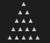
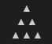

# Coding Problems

Hello Friends,

This repo is my attempt to learn programming using javascript.
My objective is to code alteast one problem per day starting with very easy and reaching to an intermidiate or expert level.

The problems are given to me by [Ankit Jain](https://github.com/ankitjaininfo), [Sachin Jain](https://github.com/jainsachinjain) and Pooja Jain who organized these in increasing order of complexity.

## List of coding problems

### Fubonacci

Write a program to print the Fubonacci for the given index.

Examples:

| Input | Output |
| :---: | :----: |
|   6   |   5    |
|  10   |   34   |
|  15   |  377   |

### Average

Find the average of the given numbers.

Examples:

|         Input         | Output |
| :-------------------: | :----: |
|        [5, 10]        |  7.5   |
|         [12]          |   12   |
| [7, 7, 7, 7, 7, 7, 7] |  377   |

### Power Of Two

Write a function to returns power of two.

Examples:

| Input | Output |
| :---: | :----: |
|   2   |   4    |
|   3   |   8    |
|  10   |  1024  |
|   5   |   32   |

### Draw A Pyramid

Given an integer input, draw a pyramid of the given height.

Examples:
| Input | Output |
|:-----:|:------:|
| 5 |  |
| 3 |  |

### Where Is My Thing?

Given an array of numbers, and an item, return the index at which this number is present.

|          Input           | Output |
| :----------------------: | :----: |
|     [5, 3, 8 ,10], 8     |   3    |
|        [8, 12], 8        |   1    |
| [1, 2, 3, 8, 12, 15], 15 |   6    |

### Palindrome

A Palindrome is a word which is same from both sides. Write a function which checks if a string is a palindrome.

Examples:

|    Input    | Output |
| :---------: | :----: |
|   Malayam   |  true  |
|    Happy    | false  |
|    Level    |  true  |
| Aibohphobia |  true  |

**Fun Fact:-** Aibohphobia is the (unofficial) name for an irrational fear of palindromes.

### Isogram

A Isogram is a word in which no letter occurs more than once. Write a function which checks if a string is a isogram.

Examples:

|  Input  | Output |
|:-------:|:------:|
| isogram |  true  |
|   boy   |  true  |
|  level  |  false |
|   good  |  false |

### Multipliction Table

Write a function which will display the multiplication table of the number given and till the specified number.

No examples for this because it is self explanitory.

### Leap Year

Return the next *n* leap years from the given year.

If the year given is `2021` and the second number is `5`, the program should output following

| (index) | Values |
| :------ | :----: |
| 0       |  2024  |
| 1       |  2028  |
| 2       |  2032  |
| 3       |  2036  |
| 4       |  2040  |

### Return the items at odd index from the given array in an array

Examples:

|        Input       |   Output  |
|:------------------:|:---------:|
|      [1, 2, 3]     |    \[2\]    |
| [234, 3, 42, 2323] | [3, 2323] |

### Interleaving Arrays

Write a function that combines two arrays by alternatingly taking elements.

Examples:

|               Input              |             Output            |
|:--------------------------------:|:-----------------------------:|
|    ['a', 'b', 'c'], [1, 2, 3]    |    ['a', 1, 'b', 2, 'c', 3]   |
| ['a', 'b', 'c'], [1, 2, 3, 4, 5] | ['a', 1, 'b', 2, 'c', 3, 4, 5]|

### Usage Of Map

Given an array, double the numbers in the array.

Examples:

|      Input      |      Output      |
|:---------------:|:----------------:|
|    [1, 2, 3]    |     [2, 4, 6]    |
| [1, 2, 3, 4, 5] | [2, 4, 6, 8, 10] |
|  [2, 3, 10, 5]  |  [4, 6, 20, 10]  |

### Usage Of Filter

Given an array, find all the leap years in the array.

Examples:

|              Input             |       Output       |
|:------------------------------:|:------------------:|
|       [2011, 2024, 2021]       |       \[2024\]       |
| [2011, 2024, 2021, 2028, 2032] | [2024, 2028, 2032] |

# Maximum Minimum

Given an array of numbers and `min` or `max` in an string, when the string is `min` or `minimum` return the lowest integer and when the string is `max` or `maximum` return the highest integer

Also no matter what case the string is like if it is `mAX` then is still should to maximum

Examples:

Maximum:

|             Input            | Output |
|:----------------------------:|:------:|
|    [12, 123, 1, 3123, 123]   |  3123  |
| [-12, -123, -1, -3123, -123] |   -1   |

Minimum:

|             Input            | Output |
|:----------------------------:|:------:|
|    [12, 123, 1, 3123, 123]   |    1   |
| [-12, -123, -1, -3123, -123] |  -3123 |